<div align="center">

# 党建智办 PartyOps

### 面向基层党建工作的本地优先协同工作台

把事项办理、跨机文件、重要档案、迎检材料、通知评论和工作留痕，收进一套真正能落地的局域网协同闭环。

[](https://github.com/pl1505031156-droid/PartyOps/releases/tag/v1.4.3-rc.6)
[](docs/release-readiness-1.4.3.md)
[](LICENSE)
[](#安装教程)
[](#安全与隐私)
[](https://github.com/pl1505031156-droid/PartyOps/stargazers)

[官方网站](https://www.partyops.cn/) · [下载安装](#下载) · [界面实景](#系统主界面实景) · [核心亮点](#partyops-的亮点) · [安装教程](#安装教程) · [更新记录](CHANGELOG.md) · [参与共建](#参与共建)

</div>

> [!IMPORTANT]
> 当前源码版本为 `1.4.3-rc.6`，数据库模式为 `0019`。rc.6 提供 Windows 10/11 x64、Windows 7 SP1 x64/x86、麒麟/UOS/deepin 双架构 DEB 和 openEuler 双架构 RPM，仍是 **未签名候选版**。Windows 7 与国产 Linux 制品尚未在对应真机完成运行验收；Win7 仅建议在受控局域网使用。详见[rc.6 发布说明](docs/release-notes-v1.4.3-rc.6.md)与[1.4.3 发布就绪判定](docs/release-readiness-1.4.3.md)。

## 当前公开发布

| 项目 | 当前状态 |
| --- | --- |
| 公开版本 | [`v1.4.3-rc.6`](https://github.com/pl1505031156-droid/PartyOps/releases/tag/v1.4.3-rc.6)，GitHub 普通 Release |
| 发布时间 | 以 GitHub Release 与官网显示的北京时间为准 |
| 冻结源码 | 不可变标签 [`v1.4.3-rc.6`](https://github.com/pl1505031156-droid/PartyOps/tree/v1.4.3-rc.6) |
| 官方网站 | [https://www.partyops.cn/](https://www.partyops.cn/) |
| 制品校验 | 七个主安装包的文件大小与 SHA-256 以同一 Release、官网和机器可读清单为准 |
| 发布边界 | Windows 10/11 已在当前 Win11 构建机执行冻结运行验收；Win7 与国产 Linux 明确标注未真机验证 |

Release 同时提供七个主安装包、可选 `.sha256`、Ed25519 签名应用内更新包、format v3 更新目录、发布清单、SBOM、VEX、安全门禁和验收记录。历史版本变化仍在 `CHANGELOG.md` 中追溯。

## 30 秒了解 PartyOps

PartyOps 不是一套把表单搬到浏览器里的系统。它解决的是基层办公最常见的断点：事项散落在聊天记录里，材料留在不同电脑上，档案与办理过程彼此脱节，迎检时再临时拼接。

系统以一台单位主机保存权威数据库和受管附件，Windows 或 UOS 协同电脑通过受控 Agent 接入。团队成员可以发布自己电脑上的真实文件夹，在权限范围内互相浏览、阅读、下载和转发；事项、材料、档案、评论、通知与审计记录始终沿同一条责任链关联。

## 系统主界面实景

下面全部来自 PartyOps 的真实浏览器流程和演示数据，不是设计稿。

<table>
  <tr>
    <td width="33%">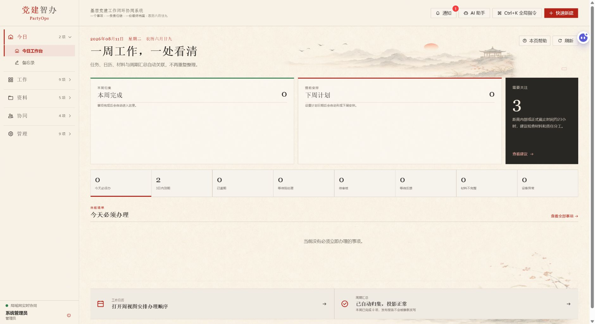<br><strong>今日工作台</strong></td>
    <td width="33%">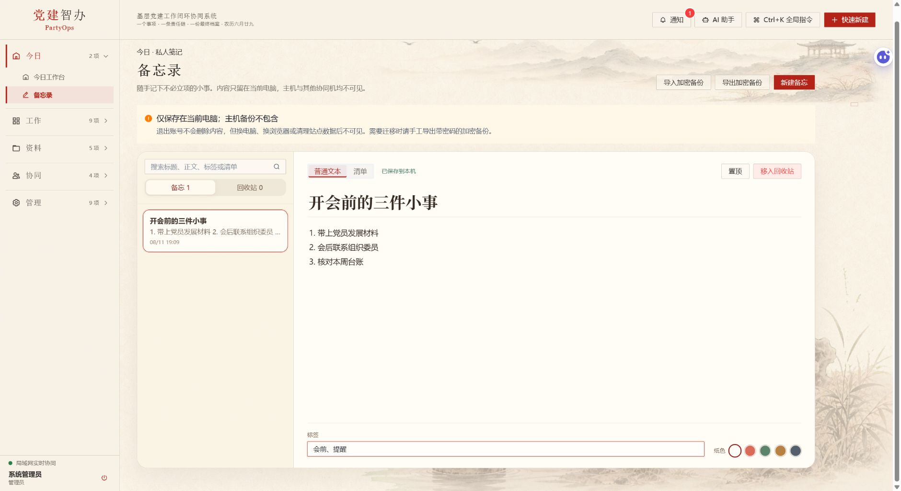<br><strong>本机私有备忘录</strong></td>
    <td width="33%">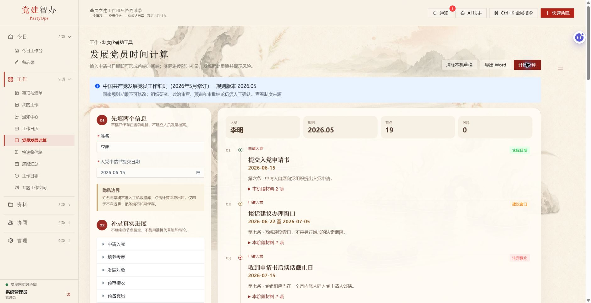<br><strong>发展党员时间计算</strong></td>
  </tr>
</table>

### 今日工作台：一周工作，一处看清

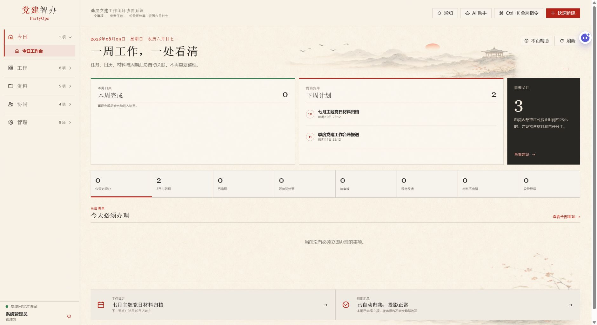

<table>
  <tr>
    <td width="50%" valign="top">
      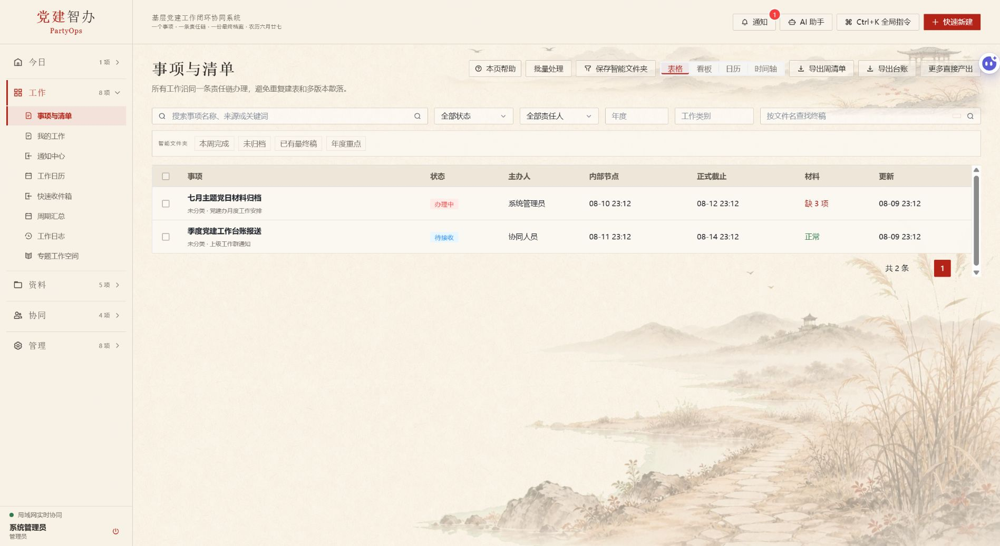<br>
      <strong>事项与清单</strong><br>
      表格、看板、日历和时间轴共享同一份事项数据，主办、协办、审核、截止时间和材料完整度一起呈现。
    </td>
    <td width="50%" valign="top">
      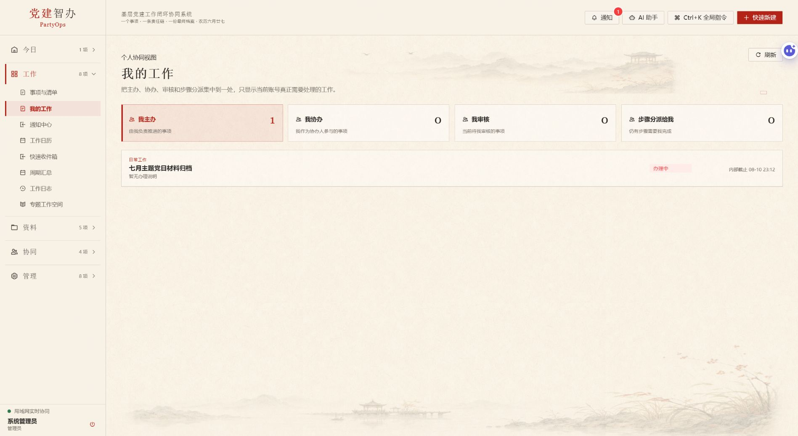<br>
      <strong>我的工作</strong><br>
      只显示当前账号真正需要处理的主办、协办、审核和步骤分派，普通协同人员不会看到空白管理页。
    </td>
  </tr>
  <tr>
    <td width="50%" valign="top">
      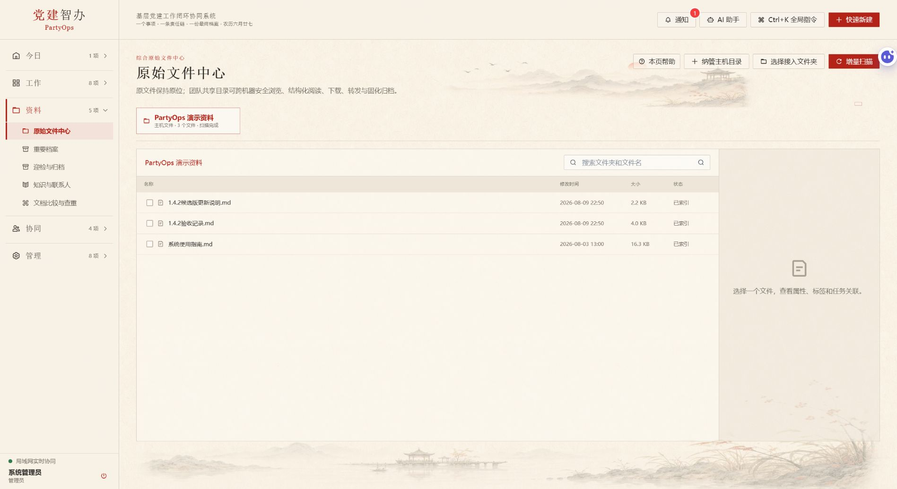<br>
      <strong>原始文件中心</strong><br>
      主机文件、协同机共享和本机共享统一显示，原文件保持原位，按权限完成索引、阅读、下载、转发和固化。
    </td>
    <td width="50%" valign="top">
      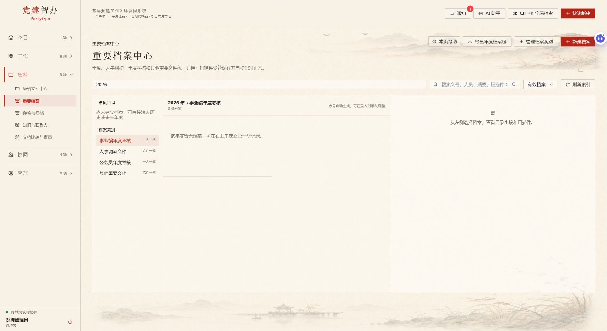<br>
      <strong>重要档案中心</strong><br>
      年度目录、档案类别、扫描件、OCR、业务关联和权限贡献形成完整档案闭环。
    </td>
  </tr>
</table>

<details>
<summary><strong>展开查看：跨机器文件与离线文档阅读实景</strong></summary>
<br>
<table>
  <tr>
    <td width="50%">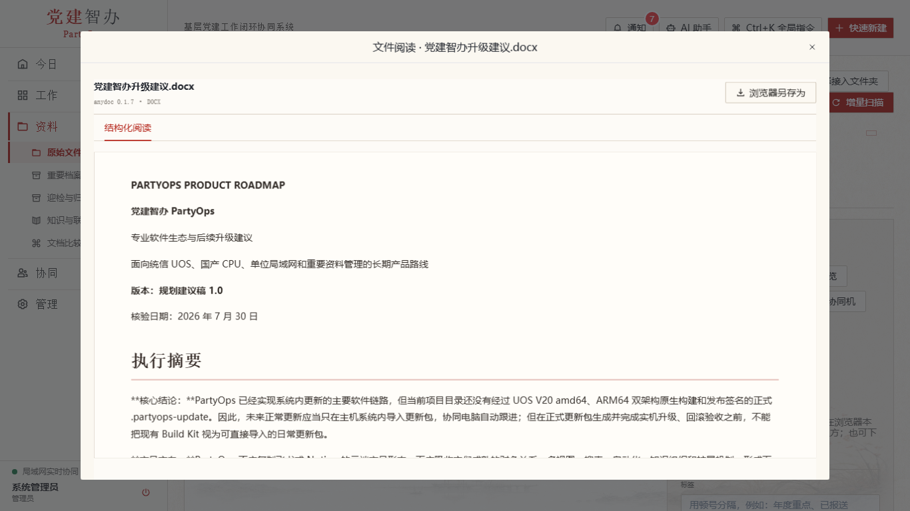<br><strong>Office 文档结构化阅读</strong></td>
    <td width="50%">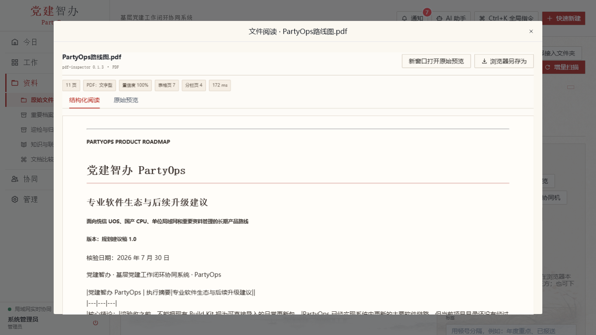<br><strong>PDF 原始版面与结构检查</strong></td>
  </tr>
  <tr>
    <td colspan="2">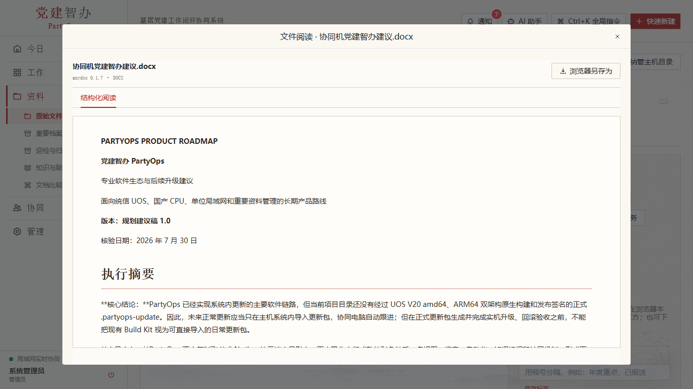<br><strong>协同机文件经主机中转、哈希校验后直接阅读</strong></td>
  </tr>
</table>
</details>

## PartyOps 的亮点

| 真协同文件网 | 一条责任链 | 档案不是孤岛 |
| --- | --- | --- |
| 已入网用户可以发布本机真实文件夹，按团队或指定人员授权浏览、下载和转发。设备间仍由主机中转，不开放 SMB、匿名共享或设备直连。 | 事项的主办、协办、审核、步骤、材料、评论、提及和通知围绕同一业务对象推进，减少重复建表和版本漂移。 | 重要档案支持年度目录、类别权限、协同贡献、扫描件、OCR、版本历史、业务关联、作废与恢复。 |
| **文件打开就能读** | **本地数据边界** | **失败可恢复、过程可追溯** |
| PDF、Word、Excel、PowerPoint、OpenDocument、RTF、EPUB、CSV 和常见文本可在文件中心打开，远端内容先完成分块传输与 SHA-256 校验。 | 文档正文不上传 Firecrawl 或外部服务；本地 AI 由管理员离线导入并按向量、LLM 两种能力启停。 | SQLite 在线快照、版本化备份、更新前备份、原子恢复、断点续传、哈希失败隔离、审计记录和设备隔离共同守住数据。 |
| **本机私有备忘** | **新版细则时间计算** | **规则与单位材料分层** |
| 细小工作用文本或清单随手记录，按账号和当前电脑隔离；支持 30 天回收站与 AES-GCM 加密备份，内容不进入主机。 | 依据 2026 年 5 月新版细则确定性计算截止、最早和建议窗口；工作日不完整时明确“暂算”，不使用 LLM 猜日期。 | 国家节点与期限写死并带条款来源；管理员只能追加本单位“三考”、思想汇报、自传等材料，不能缩短法定流程。 |

## 五大工作域

| 工作域 | 面向谁 | 主要能力 |
| --- | --- | --- |
| **今日** | 所有人 | 一周总览、临期风险、必须办理、日历节点、周期汇总与本机私有备忘 |
| **工作** | 主办、协办、审核人 | 事项与清单、我的工作、通知、日历、党员发展计算、收件箱、报告、日志和专题空间 |
| **资料** | 档案与材料经办人 | 原始文件中心、跨机共享、重要档案、迎检归档、知识库、文档比较与查重 |
| **协同** | 主机与协同机用户 | 设备入网、共享目录、接收箱、三种传输、目录与人员授权 |
| **管理** | 有效能力对应的管理员 | 周期模板、自动归档、报告模板、本地 AI、更新、备份、诊断与帮助 |

## 主机与协同机的界面差异

前端不靠零散的 `role === admin` 决定按钮，而是读取后端返回的有效能力。用户只看见自己能完成的真实操作。

| 使用位置与账号 | 可以操作的内容 |
| --- | --- |
| 主机管理员 | 主机目录纳管、团队文件、设备/目录/人员授权、档案类别、更新、备份、诊断和 AI 管理 |
| 主机普通用户 | 团队文件浏览下载、业务关联、自己的事项和传输；隐藏系统管理入口 |
| 协同机管理员 | 发布本机目录、团队文件双通道下载，同时保留获授权的全局管理能力 |
| 协同机普通用户 | 发布和管理自己的本机目录、浏览团队目录、阅读下载文件、处理自己的传输与工作 |

## 版本演进

| 版本 | 这一阶段解决了什么 | 发布状态 |
| --- | --- | --- |
| `1.4.0` | 重要档案贡献权限、通知评论、我的工作、共享目录审批和跨平台更新适配 | 内部候选 |
| `1.4.1` | 普通用户发布共享目录、团队/指定成员授权、双通道下载和本地 AI 分能力激活 | 内部候选 |
| `1.4.2-rc.1` | AnyDoc / pdf-inspector 离线文档阅读、跨机文件直接阅读、权限撤销复核和发布链路收口 | 历史 Pre-release |
| `1.4.3-rc.1` | 本机私有备忘、2026 新版细则党员发展计算、专业中文 Word 导出与单位补充材料分层 | 历史 Pre-release，已被 rc.2 取代 |
| `1.4.3-rc.2` | 自定义数据盘、主机服务可诊断启动、单 EXE 下载、前端资源闭包及 UOS 双架构严格离线校验 | 历史候选，已被 rc.3 取代 |
| `1.4.3-rc.3` | 个人模式、安全卸载、中文策略诊断、系统内升级与国产 Linux 原生 DEB/RPM | 历史普通 Release；已被 rc.4 取代 |
| `1.4.3-rc.4` | 加入 Win7 x64/x86 完整主机、官方 UCRT 与冻结 GUI 实测门禁 | 历史候选；已被 rc.5 取代 |
| `1.4.3-rc.6` | 修复 Windows PowerShell 5.1 编码导致的安装失败；阻止 Win7 误装通用包，并复核 Legacy PE 导入 | 当前候选；未签名、Win7/国产 Linux 未真机验证 |
| `1.4.3-rc.5` | 彻底修复自定义程序目录误拦截，收敛目标 ACL 与高完整性标签，补齐覆盖升级、保留数据卸载和空目录清理 | 历史候选；已由 rc.6 取代 |

完整变更、修复与安全说明见 [CHANGELOG.md](CHANGELOG.md)。PartyOps 不会为了看起来“已发布”而隐藏未完成门禁，版本证据、制品哈希和已知限制都会随 Release 一起公开。

## 跨机器文件如何工作


主机不会保存协同机的绝对路径。目录停用、成员权限撤销或设备隔离后，正在进行的传输会在创建、分块和最终读取阶段重新校验并停止。结构化阅读默认限制为 64 MiB 和 200 万字符；超过限制的文件仍可下载，PDF、图片和文本在浏览器支持范围内可使用原始预览。

文件解析使用 [Firecrawl AnyDoc](https://github.com/firecrawl/anydoc) 与 [Firecrawl pdf-inspector](https://github.com/firecrawl/pdf-inspector) 的官方 WebAssembly 包，并在一次性 Web Worker 中离线执行。详细许可证见 [THIRD_PARTY_NOTICES.md](THIRD_PARTY_NOTICES.md)。

## 下载

当前可下载版本为 [v1.4.3-rc.6 候选版](https://github.com/pl1505031156-droid/PartyOps/releases/tag/v1.4.3-rc.6)：

rc.5 使用全新的版本化文件名和不可变标签，不覆盖 rc.4。Windows 安装器支持本机固定 D/E 盘、中文与空格目录，并在释放文件后把目标目录收敛为管理员/SYSTEM 可写、普通用户只读执行；本机已覆盖宽松父目录、覆盖安装、保留数据卸载、全新重装、服务自启动和健康检查。请以 Release/官网显示的最新上传时间、大小与 SHA-256 为准。

- [Windows 10/11 x64 单文件安装器](https://github.com/pl1505031156-droid/PartyOps/releases/download/v1.4.3-rc.6/PartyOps_1.4.3-rc.6_windows_amd64.exe)
- [Windows 7 SP1 x64 单文件安装器](https://github.com/pl1505031156-droid/PartyOps/releases/download/v1.4.3-rc.6/PartyOps_1.4.3-rc.6_windows7_amd64.exe)
- [Windows 7 SP1 x86 单文件安装器](https://github.com/pl1505031156-droid/PartyOps/releases/download/v1.4.3-rc.6/PartyOps_1.4.3-rc.6_windows7_x86.exe)
- [麒麟/UOS/deepin AMD64 DEB](https://github.com/pl1505031156-droid/PartyOps/releases/download/v1.4.3-rc.6/PartyOps_1.4.3-rc.6_linux_amd64.deb)
- [麒麟/UOS/deepin ARM64 DEB](https://github.com/pl1505031156-droid/PartyOps/releases/download/v1.4.3-rc.6/PartyOps_1.4.3-rc.6_linux_arm64.deb)
- [openEuler x86_64 RPM](https://github.com/pl1505031156-droid/PartyOps/releases/download/v1.4.3-rc.6/PartyOps-1.4.3-0.rc.6.1.x86_64.rpm)
- [openEuler ARM64 RPM](https://github.com/pl1505031156-droid/PartyOps/releases/download/v1.4.3-rc.6/PartyOps-1.4.3-0.rc.6.1.aarch64.rpm)

普通 Windows 用户只需下载一个 EXE。安装器会校验其内部载荷；最终文件大小与 SHA-256 直接显示在 Release 和官网，无需再下载第二个“校验包”。同名 `.sha256` 仅为自动化工具提供，不是安装必需步骤。

国产 Linux 用户不再需要下载“构建套件 + 校验包”。每台电脑只下载一个与 CPU 架构匹配的 DEB 或 RPM，包管理器安装后会自动核对文件清单、前端资源、SQLite/FTS5、中文 OCR、本地语义、LLM、更新服务和回环健康端点。

Windows 7 x64 提供完整主机、协同、OCR、语义重排和本地 LLM；x86 提供核心主机、协同、数据库、文件、档案、备份和 OCR，受 32 位地址空间限制不启用语义重排与本地 LLM。两者均使用独立 Python 3.8 Legacy 锁、经证据校验的安全回移组件和 Microsoft 官方 app-local UCRT；由于没有 Win7 真机，仍不能把静态/冻结验证表述为真机通过。

## 安装教程

### 安装前准备

1. 选定一台长期在线、磁盘可靠的电脑作为主机；SQLite 数据目录不得放在网络共享盘。
2. 为主机设置固定局域网地址或稳定主机名，并确认所有电脑使用“专用网络”。
3. Windows 普通用户从官网或同一个 GitHub Release 下载单个 EXE；不需要额外下载校验文件。
4. 安装前用下面命令计算 SHA-256，并与官网或 Release 页面直接显示的值逐字核对。

Windows PowerShell：

```powershell
Get-FileHash .\PartyOps_1.4.3-rc.6_windows_amd64.exe -Algorithm SHA256
Get-AuthenticodeSignature .\PartyOps_1.4.3-rc.6_windows_amd64.exe
```

Linux：

```bash
dpkg --print-architecture
sha256sum PartyOps_1.4.3-rc.6_linux_amd64.deb
```

### Windows 10/11 x64

1. 双击 `PartyOps_1.4.3-rc.6_windows_amd64.exe`。未签名候选出现 SmartScreen 时，先核对 SHA-256，再选择“更多信息 → 仍要运行”。
2. PartyOps 中文安装向导会分别询问程序安装目录和业务数据目录；两者都可自定义，升级时会保留原选择。数据目录建议使用 `D:\PartyOps-数据` 等本机固定磁盘目录，支持中文和空格，不支持磁盘根目录、系统目录、网络盘或移动盘。
3. 首次打开“党建智办”，明确选择角色：
   - **个人使用（新手推荐）**：无需管理员授权，只在本机使用，不安装服务、不开放局域网。
   - **主机**：再次确认数据目录；UAC 只用于写入系统配置和启动服务。数据库、附件、备份、证书、模型、缓存和日志全部进入所选目录；C 盘只保留程序和小型引导配置。
   - **协同机**：填写主机地址并完成配对；备份、接收文件和运行日志跟随所选本机数据目录，小型入网配置保留在 `%LOCALAPPDATA%\PartyOps`。
4. 主机管理员在“管理 → 设备协同”批准设备，并按用户、设备和目录授予能力。
5. 协同用户在“资料 → 原始文件”点击“共享本机文件夹”，用系统选择器选中目录，再设置团队或指定人员范围。
6. 从另一台电脑登录，确认可以浏览、打开阅读、浏览器另存为或下载到本机接收目录。

向导会依次显示“服务注册、SCM 启动、子进程启动、端口监听、健康检查、局域网地址就绪”。遇到失败先点击“复制诊断”或“打开日志”，不要先手动修改 `services.msc`。未就绪时 PartyOps 不会打开空白地址，也不会降级为普通用户进程。

### Windows 7 SP1 x64/x86

1. 仅在已停止系统级安全维护风险可控的局域网电脑使用，并先完成 SP1、KB2533623 和 Universal CRT 更新；安装器会在释放文件前逐项检查。
2. 64 位系统下载 `PartyOps_1.4.3-rc.6_windows7_amd64.exe`；32 位系统下载 `PartyOps_1.4.3-rc.6_windows7_x86.exe`。不要按 CPU 品牌猜测，先打开“控制面板 → 系统”查看系统类型。若出现 `api-ms-win-core-path-l1-1-0.dll` 缺失，说明误用了 Windows 10/11 通用包；不要下载单个 DLL，改下正确的 Win7 专用包。
3. 安装与首次配置同样支持受管理员保护的本机 D/E 盘、中文和空格目录。不要选择磁盘根目录、网络盘、移动盘、目录联接或允许普通用户替换文件的公共目录。
4. Win7 x86 不提供语义重排与本地 LLM；这不会影响核心主机、文件协同、档案、备份和中文 OCR。Win7 不捆绑第三方浏览器，请使用单位安全策略允许的浏览器访问。

### 麒麟 / UOS / deepin / openEuler

先确认架构：

```bash
dpkg --print-architecture
```

海光、兆芯、Intel、AMD 通常使用 `amd64/x86_64`；飞腾、鲲鹏等使用 `arm64/aarch64`。麒麟、UOS、deepin 下载 DEB，openEuler 下载 RPM：

```bash
sudo apt install ./PartyOps_1.4.3-rc.6_linux_amd64.deb
# ARM64 改用 PartyOps_1.4.3-rc.6_linux_arm64.deb
```

```bash
sudo dnf install ./PartyOps-1.4.3-0.rc.6.1.x86_64.rpm
# ARM64 改用 PartyOps-1.4.3-0.rc.6.1.aarch64.rpm
```

安装后从应用菜单打开“党建智办”，按与 Windows 相同的向导选择主机或协同机。主机服务数据默认位于 `/var/lib/partyops`；日常用户的协同配置位于 `~/.config/partyops`，接收目录位于用户数据目录。无 sudo 的日常账号应由管理员安装，不要在 root 桌面完成普通用户的协同配置。

### 首次组网与目录共享

1. 主机管理员创建普通协同账号。
2. 每台协同电脑安装相同版本，选择“协同机”，提交配对请求。
3. 管理员批准设备；普通用户登录协同机。
4. 点击“共享本机文件夹”，系统会签发与用户和设备绑定、60 秒内单次有效的本机操作令牌。
5. 选择真实文件夹，设置团队共享或指定成员及浏览/下载/发送权限，执行“立即同步”。
6. 文件中心会显示“主机文件”“某协同机共享”“本机共享”和在线/同步/权限状态。
7. 远端文件点击后先拉取并校验，再显示结构化阅读或原始预览；下载可选择浏览器另存为或当前协同机接收目录。

### 升级、备份与回滚

- 一次性桥接：由于 rc.2 的发布签名私钥已经不可恢复，rc.2 及更早版本需最后一次从官网运行与本机系统、CPU 架构匹配的当前 rc.5 安装器并选择原位升级；无需卸载且默认保留数据。rc.3/rc.4 及后续版本走系统内快速升级。
- 日常升级：管理员在“管理 → 系统更新”查看官方签名目录。系统每天至多自动检查一次，只在后台下载本机对应的 Windows、DEB 或 RPM 单平台签名更新包；弱网和关机中断后从已校验位置续传，已完整校验的包不会重复下载。
- 专业门禁：安装前再次确认版本、上传时间和中文更新内容，并逐层验证 Ed25519 目录签名、更新包签名、文件大小、SHA-256、平台和架构。主机升级成功并通过版本/数据库/健康检查后，协同电脑才分别读取官方目录并获取自己的平台制品。
- 升级前：系统自动创建一致性数据库、附件和档案快照；重要升级仍建议手工导出一份完整备份到独立介质。
- 失败回滚：安装、迁移或健康检查任一步失败都会尝试恢复上一版本程序和升级前数据；回滚未完成时服务保持停止并显示中文诊断编号，禁止带病继续运行。
- 不要通过复制正在运行的 SQLite 文件做备份，也不要混用不同版本的主机和协同 Agent。

完整步骤见[安装、升级与回滚](docs/upgrade-1.4.3.md)、[备份恢复手册](docs/backup-restore.md)和[长期运行手册](docs/operations-runbook.md)。

### 卸载

- Windows：在“设置 → 应用”卸载“党建智办 PartyOps”。选“仅删除程序”会保留业务数据；选“彻底卸载”会删除经安全预检证明属于 PartyOps 的本机数据。彻底卸载不可恢复，请先验证备份。
- UOS：`sudo apt remove partyops`。如需删除 `/var/lib/partyops`，必须先验证备份且由管理员明确执行，程序不会把删除业务数据作为普通升级步骤。

## 可选本地智能

主程序不强制捆绑模型权重。管理员可以离线导入独立签名模型包：

- 中文向量：BGE 小型中文模型，用于事项、档案、知识和已授权共享目录的语义检索。
- 轻量 LLM：面向内存 8 GB 以上主机的本地草稿生成。
- 增强 LLM：面向内存 16 GB 以上主机的本地草稿生成。

本地 LLM 只生成带来源的草稿，不自动修改事项、档案或文件权限；未获正文索引授权的共享内容不会进入提示词。模型不存在、资源不足或推理失败时，系统自动降级为规则推荐与普通检索。

## 从源码运行

开发环境要求 Python 3.11—3.13、Node.js 22、Corepack 和 pnpm 11.9。

```powershell
python -m venv .venv
.\.venv\Scripts\python.exe -m pip install -r backend\requirements.txt -r backend\requirements-dev.txt
corepack enable
corepack pnpm --dir frontend install --frozen-lockfile
.\scripts\dev.ps1
```

开发页面默认为 `http://127.0.0.1:4173`。生产式同源构建：

```powershell
.\scripts\build.ps1
```

### 本地验证

```powershell
.\scripts\test.ps1
```

该脚本执行前端单元测试、覆盖率、类型检查、生产构建、Sites 兼容测试、Python 全量测试和依赖审计。项目正式门槛为前后端全仓行覆盖率至少 90%、分支覆盖率至少 80%；不要通过降低阈值或排除业务文件让发布“假绿”。

## 项目结构

- `frontend/`：Vue 3、TypeScript、Vite、Pinia、Arco Design Vue、Firecrawl WASM 阅读器。
- `backend/`：FastAPI、SQLAlchemy 2、Alembic、SQLite/FTS5、设备 Agent 和本地 AI 适配。
- `packaging/windows/`：PyInstaller 冻结运行时与 Inno Setup 安装器。
- `packaging/uos/`：UOS V20 amd64/arm64 离线构建、DEB 与统一更新包。
- `docs/`：安装、使用、备份、运行、验收和发布文档。
- `docs/images/`：经真实浏览器流程采集的项目截图。

## 安全与隐私

- 生产部署应使用 HTTPS；设备凭据、用户会话和一次性本机操作令牌都有独立边界。
- 浏览器文档解析禁用 Markdown HTML、外部图片和危险协议；HTML、XML、SVG 不提供可能联网的原始内联预览，预览关闭后销毁 Worker 和临时对象 URL。
- 文件权限在传输创建、每个分块和最终读取时复核，源文件 inode、修改时间、大小与最终 SHA-256 必须一致。
- 不要提交私钥、模型权重、生产备份、用户数据、QA 配置或未脱敏日志。
- 发现安全问题请先通过仓库维护者提供的私密渠道报告，不要在公开 Issue 附带真实数据或凭据。

## 参与共建

PartyOps 希望把“基层真正怎么办公”变成可以持续改进的开源产品。如果它对你有启发，欢迎点击右上角 **Star**，让更多需要本地协同、国产系统适配和党建业务闭环的团队看到它。

- **想直接体验**：从 [v1.4.3-rc.6 Release](https://github.com/pl1505031156-droid/PartyOps/releases/tag/v1.4.3-rc.6) 下载与本机系统和 CPU 架构匹配的单文件安装包，先阅读已知限制并核对页面显示的 SHA-256。
- **发现问题**：在 [Issues](https://github.com/pl1505031156-droid/PartyOps/issues) 提交版本、系统、主机/协同机角色、复现步骤、期望/实际结果和已脱敏日志。
- **有产品建议**：在 [Discussions](https://github.com/pl1505031156-droid/PartyOps/discussions) 讲清真实工作场景、现在怎么做、卡在哪里、哪些角色会受益。
- **愿意贡献代码**：先阅读[贡献指南](CONTRIBUTING.md)，从 `main` 创建短分支，为修复补充回归测试，并运行 `scripts/test.ps1`。
- **能提供真机环境**：Windows 10、UOS amd64/arm64、20GB 大文件和 24 小时长稳测试反馈最有价值。

建议不必宏大。一个按钮命名不清、一种档案字段不好录、一台协同电脑断线后不好恢复，都是值得解决的真实问题。请不要在公开 Issue 或 Discussion 上传真实档案、账号、密钥、内部文件或未脱敏日志。

## 许可证与致谢

PartyOps 自有代码采用 [GNU General Public License v3.0](LICENSE)，并组合使用 AGPL-3.0 的 PyMuPDF；网络交互与二进制再分发需要同时遵守相应源代码提供义务。第三方组件、许可证边界和完整依赖清单见 [THIRD_PARTY_NOTICES.md](THIRD_PARTY_NOTICES.md)、[Python SBOM](docs/sbom-python.cdx.json) 与 [前端 SBOM](docs/sbom-frontend.cdx.json)。特别感谢 [Firecrawl AnyDoc](https://github.com/firecrawl/anydoc) 和 [pdf-inspector](https://github.com/firecrawl/pdf-inspector) 为离线文档阅读提供的开源能力。

更多资料：[完整文档索引](docs/README.md) · [更新记录](CHANGELOG.md) · [安全策略](SECURITY.md) · [使用说明](docs/user-guide.md) · [1.4.3 更新说明](docs/党建智办-1.4.3-更新说明.txt) · [2026 党员发展规则](docs/party-development-rules-2026.md) · [1.4.3 验收记录](docs/acceptance-1.4.3.md) · [需求追踪矩阵](docs/requirements-matrix.md)
