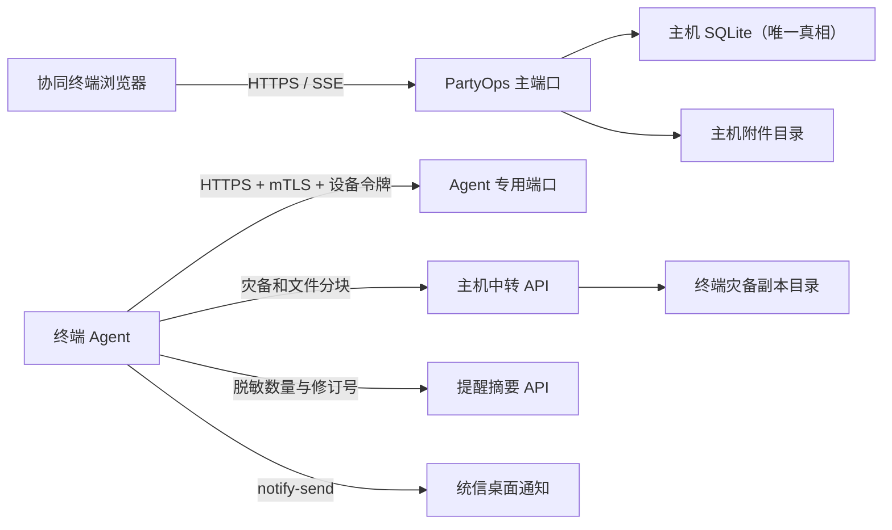

# 党建智办部署说明

## 1. 部署模型

主机运行单个 PartyOps 业务进程并保存唯一 SQLite 数据库、附件、备份和日志。协同终端只在桌面登录时运行 Agent，不开放终端入站服务，也不保存可写业务数据库。主端口供浏览器使用，下一端口为强制客户端证书的 Agent 通道。



## 2. 主机配置

生产配置使用环境变量或 `/etc/partyops/partyops.env`：

```ini
PARTYOPS_ENVIRONMENT=production
PARTYOPS_MODE=host
PARTYOPS_HOST=192.168.10.20
PARTYOPS_PORT=18765
PARTYOPS_AGENT_PORT=18766
PARTYOPS_TLS_ENABLED=true
PARTYOPS_DATA_DIR=/var/lib/partyops
PARTYOPS_STRICT_SQLITE=true
PARTYOPS_SEED_DEMO=false
PARTYOPS_BACKUP_HOUR=18
PARTYOPS_BACKUP_MINUTE=30
```

`PARTYOPS_HOST` 必须是主机明确选定的可信局域网地址，不使用 `0.0.0.0`，不做公网端口映射。

## 3. UOS V20 离线构建

便携包必须分别在计划支持的最旧 UOS V20 amd64 与 UOS V20 ARM64 目标机上原生构建。PyInstaller 不捆绑 glibc，也不是跨架构编译器，不能在较新的 Linux 或 amd64 电脑上构建后假设兼容旧系统与 ARM64。

在联网 Windows 准备机执行：

```powershell
.\scripts\prepare-uos-offline.ps1 -Architecture all
.\scripts\package-uos-build-kit.ps1
```

得到 `artifacts/PartyOps-UOS-build-kit.zip` 和 `.sha256`。套件包含源码、已构建前端、amd64/ARM64 两套 Linux 离线轮子、两种架构的独立 CPython 3.11.15、SQLite/pysqlite3 源码及依赖哈希。准备过程会生成并校验：

- `vendor/sqlite-amalgamation-3510300.zip`
- `vendor/pysqlite3-0.5.4.tar.gz`
- `vendor/cpython-3.11.15+20260623-x86_64-unknown-linux-gnu-install_only_stripped.tar.gz`
- `vendor/cpython-3.11.15+20260623-aarch64-unknown-linux-gnu-install_only_stripped.tar.gz`
- `vendor/wheels/amd64/` 与 `vendor/wheels/arm64/` 中全部锁定轮子

UOS 目标机需为 glibc ≥2.28，构建目录至少有 4 GiB 可用空间，并使用具有管理员授权的日常桌面账号。先核对套件 SHA-256，再执行一条命令完成环境检测、构建、安装和桌面集成：

```bash
sha256sum -c PartyOps-UOS-build-kit.zip.sha256
unzip PartyOps-UOS-build-kit.zip
cd PartyOps
bash install.sh
```

目录已有与本机架构匹配的 1.1.1 `.deb` 时，脚本只做哈希校验和安装/升级，不安装构建环境。没有预构建包时才进入原生构建：UOS 软件源没有 Python 3.11 时，自动解压本机架构的独立 CPython 3.11.15，不再依赖 `python3.11-venv/dev` 系统包。其他工具缺失时优先安装 `vendor/system-debs/<架构>` 中的匹配包，否则从当前可信 UOS 软件源安装编译、压缩和 Tesseract 中文 OCR。完全离线且缺少系统工具时停止并报告缺项。

安装后会创建应用菜单、专属图标和当前用户桌面快捷方式，并打开“主机 / 协同终端”向导。若只构建不安装，分别运行 `build-portable.sh` 与 `build-deb.sh`。需要开机后不登录也持续提供服务时，可使用高级系统服务命令：

```bash
bash packaging/uos/build-and-install.sh 192.168.10.20
```

必须把 IP 替换为该 UOS 主机网卡上的真实 RFC1918 地址；脚本拒绝 `0.0.0.0`、公网地址和不属于本机的地址。

输出：

- `artifacts/PartyOps-uos-amd64.tar.zst`
- `artifacts/PartyOps-uos-arm64.tar.zst`
- `artifacts/partyops_1.1.1_amd64.deb`
- `artifacts/partyops_1.1.1_arm64.deb`
- `artifacts/SHA256SUMS.amd64`、`artifacts/SHA256SUMS.arm64`
- `artifacts/dependency-sha256-amd64.txt`、`artifacts/dependency-sha256-arm64.txt`

两种架构制品汇总后执行 `scripts/package-uos-release.ps1`，生成同时包含两套包并自动选包的离线发布 ZIP。

构建脚本会先把 SQLite 3.51.3 amalgamation 静态编译进 `pysqlite3`，再打包应用；启动时 `PARTYOPS_STRICT_SQLITE=true` 会拒绝低版本或缺少 FTS5 的运行时。

安装后执行目标机验收并保留结果：

```bash
bash packaging/uos/target-acceptance.sh https://192.168.10.20:18765
```

## 4. 安装与桌面入口

一键安装完成后，统信启动器和桌面都会显示“党建智办”及红色文书图标。首次双击进入角色向导，配置完成后再次双击会直接启动或打开系统。

amd64 便携包示例（ARM64 将文件名替换为 `arm64`）：

```bash
tar --zstd -xf PartyOps-uos-amd64.tar.zst -C /opt
sudo install -d -o "$USER" -g "$USER" /var/lib/partyops
/opt/PartyOps/start.sh
```

Debian 包：

```bash
sudo apt-get install ./partyops_1.1.1_amd64.deb
```

ARM64 D2000/8 必须安装 `partyops_1.1.1_arm64.deb`。也可以在统信文件管理器中直接双击匹配架构的 `.deb`。首次双击桌面“党建智办”，选择主机或协同终端。若单位启用了主机防火墙，只对可信局域网网段放行浏览器端口及 Agent 端口；不要做路由器公网映射。

## 5. 协同终端

协同终端安装与自身处理器匹配的 `.deb`；主机为 amd64、终端为 ARM64 时两者包文件不同，但应用版本和协议相同。终端无需启用 `partyops` 主机业务服务。管理员在“设备与协同中心”生成 10 分钟入网码，然后在终端双击“党建智办”，填写主机地址、设备名称、包含 CA 指纹的一次性入网码和可共享的本机文件夹。终端先校验 CA 指纹，再提交入网请求；主机批准目录和权限后，Agent 才开始上传索引与执行传输。

向导只创建 `~/.config/partyops/client.json`，不会创建业务数据库；同时安装桌面会话自启动项。也可手工执行：

```bash
/opt/PartyOps/partyops-client --config "$HOME/.config/partyops/client.json"
```

终端断开时不会写入第二份业务数据库；恢复在线后补拉最新备份。

浏览器中的任务更新依赖主机 SSE，断线会自动按事件编号续传；SSE 不可用时页面每 10 秒短轮询。终端伴随进程仅主动访问主机健康检查、最新备份和脱敏提醒摘要接口，不监听任何入站端口。

Agent 每 15 秒发送心跳、轮询幂等命令，并按低负载周期只上传获批目录的相对路径、文件名、大小、类型和修改时间，不读取或上传正文/OCR。跨设备文件始终经主机中转，默认 8MB 分块、20GB 单文件、100GB 中转配额。Agent 还会每 30 秒访问提醒摘要接口；该接口只返回未读数量和修订号，不返回任务标题、正文、敏感事项或主机路径。

## 6. 数据、日志与诊断

- 数据库：`$PARTYOPS_DATA_DIR/partyops.db`
- 附件：`$PARTYOPS_DATA_DIR/attachments/`
- 备份：`$PARTYOPS_DATA_DIR/backups/`
- 导出：`$PARTYOPS_DATA_DIR/exports/`
- 日志：`$PARTYOPS_DATA_DIR/logs/partyops.log`，5 MB × 6 份轮转
- 健康检查：`GET /api/v1/health`

## 7. 回滚

1.0.0 升级到 1.1.1 时保持相同 Debian 包名 `partyops`，不卸载、不新建图标和数据库。启动时先创建 `pre-upgrade` 备份，再迁移到模式 `0008`。管理员可导入签名 `.partyops-update`，由 root 更新服务执行 SQLite 在线快照、匹配架构安装、健康检查和失败回滚。详见 `docs/upgrade-1.1.md`。

卸载 `.deb` 不删除 `/var/lib/partyops`。需要彻底清理数据时必须另行人工确认并先导出备份。

## 8. 构建边界

本项目最后一次 Windows 侧验证日期为 2026-07-28。Windows 已完成前后端构建、67 项后端测试、覆盖率门槛、前端测试和安装脚本静态核对；UOS 原生 `.tar.zst`/`.deb`、amd64/ARM64 指令集兼容、systemd 重启、自带中文 OCR 与 `notify-send` 桌面弹窗仍须在两种实际 UOS V20 目标机运行上述脚本后确认。不得把 Windows 生成的文件改名冒充 Linux 制品。
